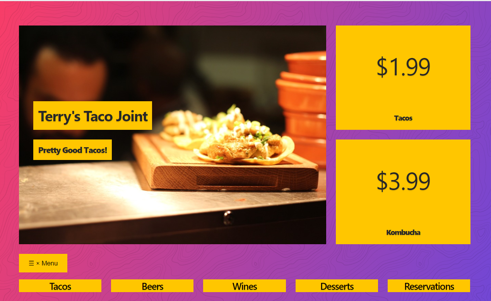

# About The Project
This class work is to build a responsive website using grid.

# Image

# Built With
* CSS
* HTML

# Author
* 👩Esther Davies
* Github: https://github.com/Esther94
* Twitter: @Esther62849599

# Facilitators
* [Godwin Nwachukwu](https://github.com/Gnwin).

* [Chioma James](https://github.com/Chiomy).

# Acknowledgements
* HomeFrontStartup
* http://homefrontstartup.com.ng/
* Mentors International
* https://mentorsint.com/
* https://www.facebook.com/mentorshubyola/
* https://twitter.com/hub_mic
* https://www.linkedin.com/company/michub/

# Live Demo
[See project live here] (https://raw.githack.com/Esther94/mini-classwork/main/responsive-START.html)

# 🤝 Contributions
* This project is open to your comments and contributions.
